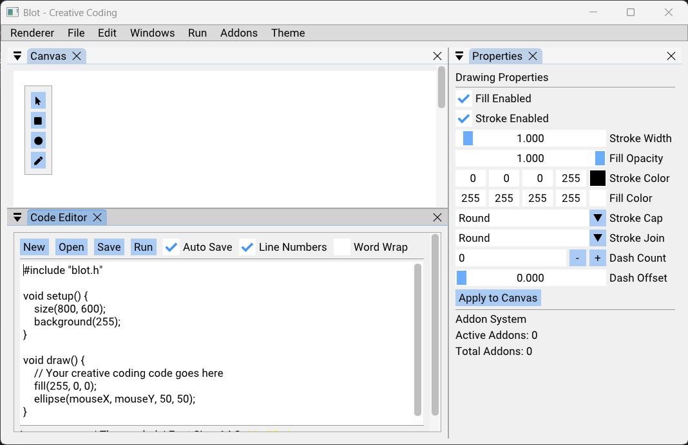

# blot

Blot (Pronounced Beelot) is a creative coding framework inspired by OpenFrameworks and DrawBot.

### Dependencies

| Library      | Purpose                       | How Managed   | Notes                                 |
|-------------|--------------------------------|---------------|---------------------------------------|
| [GLFW3]     | Window/input management        | submodule     |                                       |
| [FreeType]  | Font/text rendering            | vcpkg         |                                       |
| [GLM]       | Math (vectors/matrices)        | submodule     | Header-only                           |
| [GLAD]      | OpenGL loader                  | vcpkg         |                                       |
| [DearImGui] | UI framework                   | submodule     |                                       |
| [Blend2D]   | 2D vector graphics             | vcpkg         | Native/system for Pi recommended      |
| [EnTT]      | ECS (Entity-Component-System)  | submodule     | Header-only                           |
| [spdlog]    | Logging                        | submodule     | Header-only                           |

### Prerequisites

- CMake 3.16 or higher
- C++17 compatible compiler
- vcpkg for dependency management

### Build Instructions

Use the build script.

## Contributing

1. Fork the repository
2. Create a feature branch
3. Make your changes
4. Add tests if applicable
5. Submit a pull request

For code style and contribution guidelines, see [docs/contributing.md](docs/contributing.md).

## License

This project is licensed under the MIT License - see the LICENSE file for details.

## Acknowledgments

- Inspired by [OpenFrameworks](https://openframeworks.cc/), [DrawBot](https://drawbot.com/) and Pixile. 
- Uses [Dear ImGui](https://github.com/ocornut/imgui) for UI
- With `Node Editor` integration from [imgui-node-editor](https://github.com/thedmd/imgui-node-editor)
- Graphics powered by [OpenGL](https://www.opengl.org/) and [Blend2D](https://blend2d.com/)
- Entity-Component-System by [EnTT](https://github.com/skypjack/entt)

## Development Credits

This project was developed with assistance from Claude Sonnet 4 and OpenAI ChatGPT-o3.

[GLFW3]: https://github.com/glfw/glfw
[FreeType]: https://gitlab.freedesktop.org/freetype/freetype
[GLM]: https://github.com/g-truc/glm
[GLAD]: https://github.com/Dav1dde/glad
[DearImGui]: https://github.com/ocornut/imgui
[Blend2D]: https://github.com/blend2d/blend2d
[EnTT]: https://github.com/skypjack/entt
[spdlog]: https://github.com/gabime/spdlog
