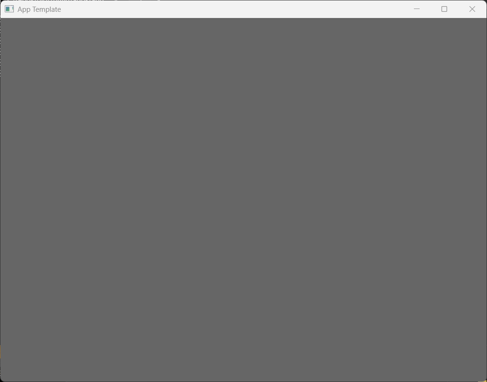

# Blot



**Blot** is a lightweight creative application framework inspired by [OpenFrameworks]. Built around an Entity-Component-System architecture, it's designed to be fast enough to run on single-board computers like the Raspberry Pi while providing a flexible foundation for creative programming projects.

## Dependencies

| Library     | Purpose                        | How Managed   | Notes             |
|-------------|--------------------------------|---------------|-------------------|
| [GLFW3]     | Window/input management        | submodule     |                   |
| [GLM]       | Math (vectors/matrices)        | submodule     | Header-only       |
| [GLAD]      | OpenGL loader                  | Included      |                   |
| [EnTT]      | ECS (Entity-Component-System)  | submodule     | Header-only       |
| [spdlog]    | Logging                        | submodule     | Header-only       |

## Prerequisites

- CMake 3.16 or higher
- C++17 compatible compiler (MSVC, clang, or gcc)

## Quick Start

### Windows
```bash
git submodule update --init --recursive   # Initialize third-party dependencies
quick_build.bat Release sample_app        # One-line configure + build
```

### Linux/macOS
```bash
git submodule update --init --recursive   # Initialize third-party dependencies
./build.sh Release sample_app             # One-line configure + build
```

For detailed build instructions, see the [Build Documentation](./docs/build_instructions.md) in the [docs/](./docs) folder.

## Known Addons

- [ ] **bxImGui** - Adds Dear ImGui UI components  
- [ ] **bxTestEngine** - ImGui Test Engine for BLot  
- [ ] **bxBlend2D** - 2D vector graphics rendering  
- [ ] **bxMarkdown** - Markdown support  
- [ ] **bxCodeEditor** - Code editing capabilities  
- [ ] **bxNodeEditor** - ImGui-based node editor  
- [ ] **bxOsc** - Open Sound Control support  
- [ ] **bxScriptEngine** - Scripting engine integration  

## Contributing

We welcome contributions! Here's how to get started:

1. Fork the repository
2. Create a feature branch (`git checkout -b feature/amazing-feature`)
3. Read the [documentation](docs/) for development guidelines
4. Make your changes
5. Add tests if applicable
6. Submit a pull request

For detailed contribution guidelines, see [docs/contributing.md](docs/contributing.md).

> [!TIP]
> **Looking for things to work on?** Check our [TODO.md](./TODO.md) for current priorities and areas that need attention.

## License

This project is licensed under the MIT License - see the [LICENSE](LICENSE) file for details.

## Acknowledgments

- Inspired by [OpenFrameworks], [DrawBot], and Pixile
- UI powered by [DearImGui]
- Node Editor integration from [imgui-node-editor](https://github.com/thedmd/imgui-node-editor)
- Graphics rendering via [OpenGL](https://www.opengl.org/) and [Blend2D]
- Entity-Component-System architecture by [EnTT]

## Development Credits

This project was developed with assistance from Claude Sonnet 4 and OpenAI ChatGPT-4.

> [!CAUTION]
> **Note**: While Blot offers a unique ECS-based approach to creative coding, it's designed for larger, more complex projects. For quick sketching and prototyping, we recommend [OpenFrameworks] for most users. However, if you specifically need the composition-based architecture that Blot provides, it can be an excellent choice. In creative projects, composition over inheritance often makes more sense than traditional object-oriented approaches.

### Why a new project and not a fork of OpenFrameworks?

Adding an Entity-Component System to OpenFrameworks isn't straightforward due to its existing architecture. While you can experiment with the [ofxEntt](https://github.com/ofxyz/ofxEnTT) plugin, OpenFrameworks' design wasn't built with ECS in mind from the ground up. OpenFrameworks uses traditional inheritance-based design, while ECS requires composition-based architecture. OpenFrameworks backends are maintained as private, restricting direct memory access that ECS systems often need for optimal performance. Also building from scratch allows for consistent attribute access patterns across all components, rather than working around existing getter/setter patterns. But really, starting from the ground up provides valuable insights into framework design and ECS implementation so it is a bit of a learning process for me as well.

[OpenFrameworks]: https://openframeworks.cc/
[DrawBot]: https://drawbot.com/
[GLFW3]: https://github.com/glfw/glfw
[FreeType]: https://gitlab.freedesktop.org/freetype/freetype
[GLM]: https://github.com/g-truc/glm
[GLAD]: https://github.com/Dav1dde/glad
[DearImGui]: https://github.com/ocornut/imgui
[Blend2D]: https://github.com/blend2d/blend2d
[EnTT]: https://github.com/skypjack/entt
[spdlog]: https://github.com/gabime/spdlog
