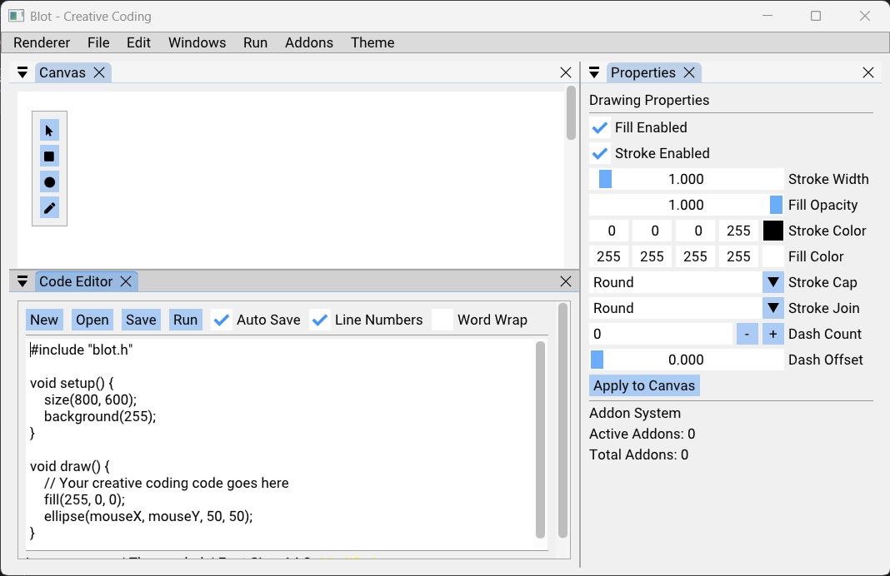

# blot



Blot (Pronounced Beelot) is a creative coding framework inspired by OpenFrameworks and DrawBot.
It suposed to be a super light Entity Component System for creative programming, all weight should come from it's addons.
It should run on a single-board computer like the Raspberry Pi.

### Dependencies
| Library     | Purpose                        | How Managed   | Notes             |
|-------------|--------------------------------|---------------|-------------------|
| [GLFW3]     | Window/input management        | submodule     |                   |
| [GLM]       | Math (vectors/matrices)        | submodule     | Header-only       |
| [GLAD]      | OpenGL loader                  | Included      |                   |
| [DearImGui] | UI framework                   | submodule     |                   |
| [Blend2D]   | 2D vector graphics             | submodule     | *Included Addon*  |
| [EnTT]      | ECS (Entity-Component-System)  | submodule     | Header-only       |
| [spdlog]    | Logging                        | submodule     | Header-only       |

### Prerequisites
- CMake 3.16 or higher
- C++17 compatible compiler (MSVC, clang, or gcc)

### Quick Build (Windows example)
```
git submodule update --init --recursive   # bring in third-party code
quick_build.bat Release sample_app        # one-line configure + build
```

Detailed [Build Instructions](./docs/build_instructions.md) in [docs/](./docs) foder.

On Linux/macOS replace the batch script with `./build.sh` or run the usual `cmake` commands.

## Contributing
1. Fork the repository
2. Create a feature branch
3. Read the [docs](docs/)!
4. Make your changes
5. Add tests if applicable
6. Submit a pull request

For code style and contribution guidelines, see [docs/contributing.md](docs/contributing.md).
Also check our [TODO.md](./TODO.md) for things that require attention.


## License
This project is licensed under the MIT License - see the LICENSE file for details.

## Acknowledgments
- Inspired by [OpenFrameworks](https://openframeworks.cc/), [DrawBot](https://drawbot.com/) and Pixile. 
- Uses [Dear ImGui](https://github.com/ocornut/imgui) for UI
- With `Node Editor` integration from [imgui-node-editor](https://github.com/thedmd/imgui-node-editor)
- Graphics powered by [OpenGL](https://www.opengl.org/) and [Blend2D](https://blend2d.com/)
- Entity-Component-System by [EnTT](https://github.com/skypjack/entt)


## Development Credits
This project was developed with assistance from Claude Sonnet 4 and OpenAI ChatGPT-o3.
It was heavily inspired by [Openframeworks](openframeworks.cc) which I would recommend you use.
Unless you want, like me, an Entity–component–system type of framework.
Which might, or might not be, a good idea.
But as a creative, composition over inherritence makes a lot of sense.

[GLFW3]: https://github.com/glfw/glfw
[FreeType]: https://gitlab.freedesktop.org/freetype/freetype
[GLM]: https://github.com/g-truc/glm
[GLAD]: https://github.com/Dav1dde/glad
[DearImGui]: https://github.com/ocornut/imgui
[Blend2D]: https://github.com/blend2d/blend2d
[EnTT]: https://github.com/skypjack/entt
[spdlog]: https://github.com/gabime/spdlog
